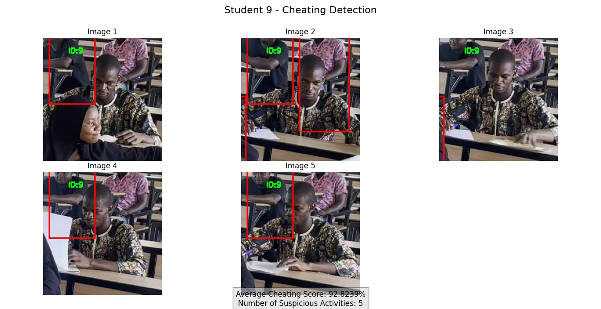
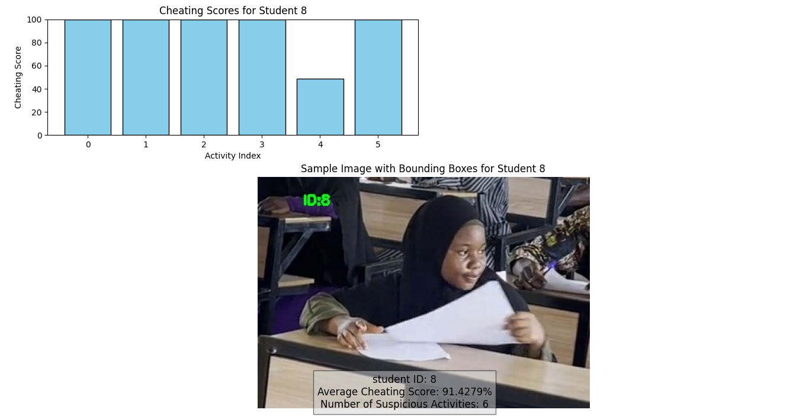
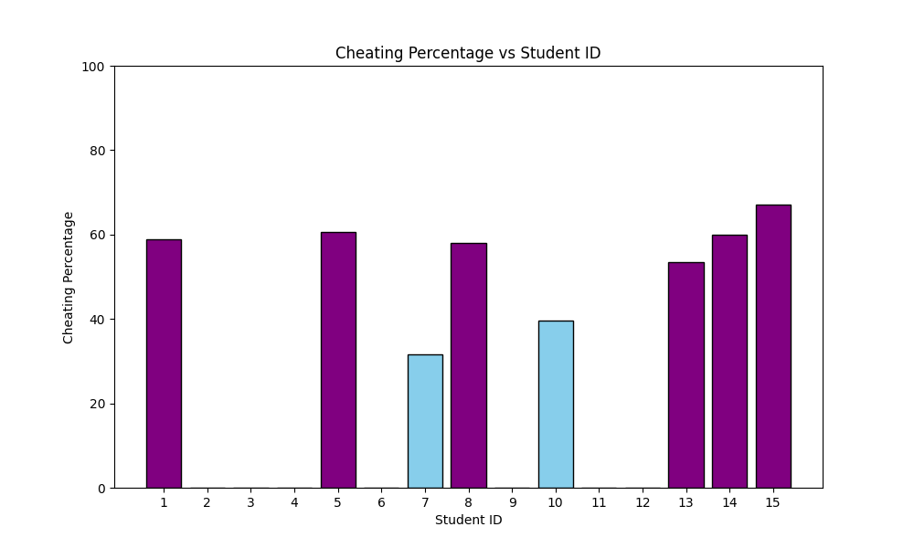
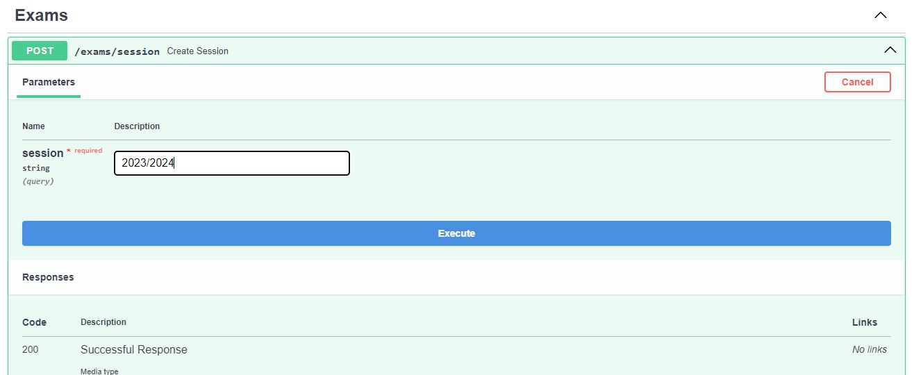
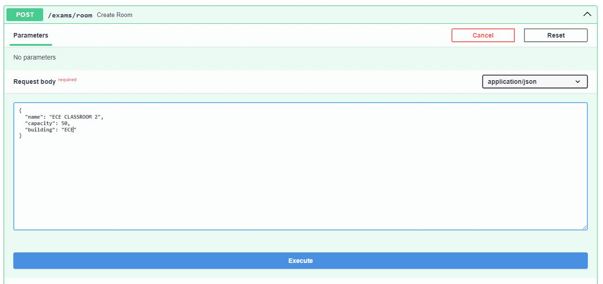
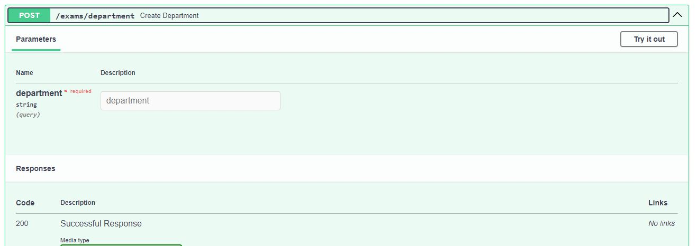
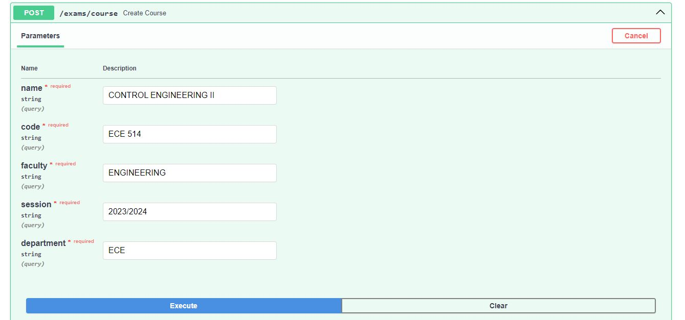
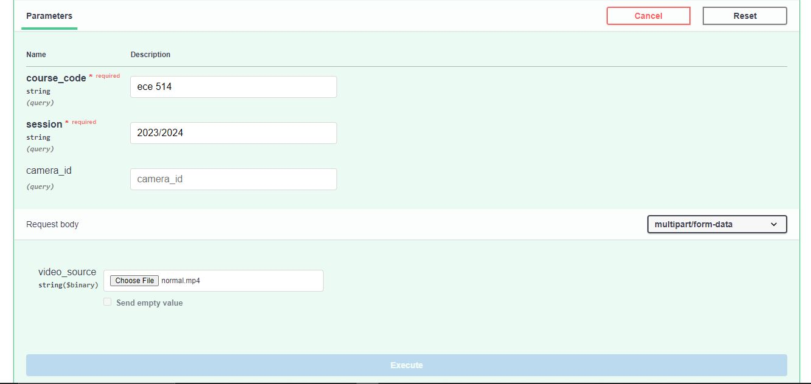
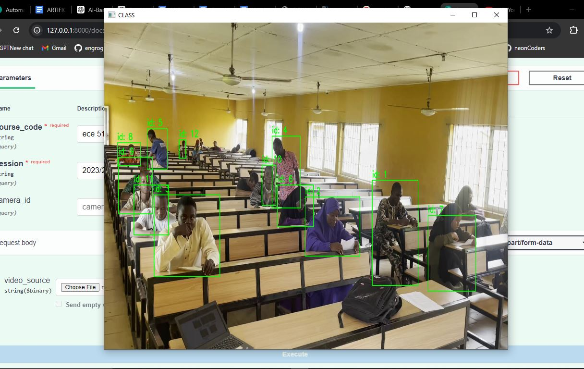

# AI-Based Invigilation System

## About This Project

This project is part of a research initiative aimed at developing an AI-based invigilation system for detecting cheating behaviors during online exams. By utilizing advanced computer vision techniques and machine learning models, this system seeks to provide a reliable and automated solution for monitoring examinees' behavior in real-time.

## Research Context

This work is a research project focusing on:

- **Objective**: To explore the efficacy of AI and machine learning in enhancing online exam security through invigilation.
- **Techniques Used**: The system employs the Lucas-Kanade optical flow technique and object detection models (e.g., YOLO) to monitor human body movements, such as head tilts, hand gestures, and posture shifts, which may indicate cheating behaviors.
- **Applications**: This research aims to contribute to the field of educational technology by providing insights into automated proctoring solutions.

## Read the Full Journal

For a detailed explanation of the research methodology, findings, and conclusions, you can read the full journal article [here](docs\Final Year Project (1).pdf).

### **Features**

- Highlight the key features of your system to give users a quick summary of its capabilities.

```markdown
## Features

- Real-time monitoring of examinees using computer vision.
- Detection of suspicious behaviors such as head tilts, hand gestures, and posture shifts.
- Adaptable for both in-person and remote exams.
- Customizable sensitivity and detection thresholds.
- Integration with APIs for extended functionality.
```

## Results Sample







# AI-Based Invigilation System User Manual

## Table of Contents

1. [Introduction](#introduction)
   - [Purpose](#purpose)
   - [System Overview](#system-overview)
2. [System Requirements](#system-requirements)
   - [Hardware Requirements](#hardware-requirements)
   - [Software Requirements](#software-requirements)
3. [Installation Guide](#installation-guide)
   - [Software Installation](#software-installation)
   - [Camera Setup](#camera-setup)
4. [System Configuration](#system-configuration)
   - [Configuration Files](#configuration-files)
   - [Model Loading](#model-loading)
5. [System Operation](#system-operation)
6. [Maintenance and Troubleshooting](#maintenance-and-troubleshooting)
7. [FAQs](#faqs)
8. [Contact and Support](#contact-and-support)

## Introduction

### Purpose

This manual provides detailed instructions on the installation, setup, and operation of the AI-based invigilation system designed to detect cheating during exams using optical flow and object detection techniques.

### System Overview

The AI-based invigilation system utilizes computer vision algorithms and machine learning models to monitor human body movements during online exams. The system employs the Lucas-Kanade optical flow technique to track and interpret movements, such as head tilts, hand gestures, and posture shifts, which are commonly associated with cheating behaviors.

## System Requirements

### Hardware Requirements

- **Camera**: A high-definition webcam with a minimum resolution of 1080p.
- **Computer**:
  - CPU: Intel Core i5 or equivalent
  - RAM: 8 GB minimum
  - GPU: NVIDIA GPU with CUDA support (recommended for faster processing)
  - Storage: Minimum 50 GB free space
- **Internet Connection**: Stable connection for real-time monitoring and updates.

### Software Requirements

- **Operating System**: Windows 10
- **Python**: Version 3.7 or later
- **Required Libraries**:
  - OpenCV
  - NumPy
  - Scikit-learn
  - TensorFlow
  - PyTorch
  - Joblib
  - FastAPI for API integration
- **Others**: Compatible IDE (e.g., PyCharm, VS Code)

## Installation Guide

### Software Installation

1. **Install Python**: Download and install Python from [python.org](https://python.org).
2. **Install Git**: Download and install Git from [git-scm.com](https://git-scm.com/downloads).
3. **Install Visual Basic 2015**.
4. **Set Up Virtual Environment**:
   - Open a terminal and navigate to your project directory.
   - Clone the project from GitHub: `git clone https://github.com/engrogundeko/AI-INVIGILATING-SYSTEM.git`
   - Open the directory: `cd AI-INVIGILATING-SYSTEM`
   - Run `python -m venv venv` to create a virtual environment.
   - Activate the virtual environment:
     - On Windows: `venv\Scripts\activate`
     - On macOS/Linux: `source venv/bin/activate`
   - Install required libraries: Run `pip install -r requirements.txt` where `requirements.txt` includes all the necessary libraries.

### Camera Setup

- Position the camera at an angle that captures the upper body, including the head, shoulders, and desk area of each examinee.
- Ensure adequate lighting and clear visibility of the examinee’s movements.

## System Configuration

### Configuration Files

- Modify configuration files (`.env`) to set parameters like file storage and database.
- The WORKING_DIR should be the directory of the cloned repository
- The MEDIA directory can be any directory

**Example Configuration**:

```yaml
WORKING_DIR="C:\Users\Admin\Desktop\AI INVIGILATING SYSTEM"
MEDIA="C:\Users\Admin\Desktop\AI INVIGILATING SYSTEM\media"
MODEL_VERSION = 5 # MODEL VERSION RANGES FROM 1 - 5
```

## System Operation

### Running the System

1. **Start the Application**:
   - Navigate to the main project directory.
   - Run the main script:
     ```bash
     python -m run
     ```
   - Navigate to your desktop, look for the app `ais`, and launch it.
   - Wait for 3 minutes until the web browser opens and the server starts running.

### Setting the Application Up

#### Setting a Session

- The first step is to create an academic session.

  

#### Setting a Faculty, Department, Room, and Course

- Create a faculty, department, and course. Ensure that the same names are used consistently when creating courses.

  

  

  

  

#### Creating an Exam

- Ensure the start and end times are in the format `H:M:S` and the date is in `Y-M-D`.

  

### Checking Available Cameras

- If the camera returns 1 or 2, it is likely that the camera is connected to the webcam.

  

### Take Attendance or Coordinates of Students

**Steps:**

1. Go to the take attendance endpoints.
2. Enter the course code and session.
3. If the video has been recorded, enter the video file.
4. For live streaming, enter the ID of the camera.
5. Click execute and wait for the popup windows to appear.
6. Click “`s`” to save and “`q`” to retry again.



### Real-time Monitoring

1. Go to the video endpoint and fill in the details to start monitoring.
2. If `user_timer` is set to true, the cheat detection will only work during the duration of the exam.
3. If `record_video` is set to true, the streaming will be recorded, but the processing may be slower.
4. The system will automatically begin capturing video input from the connected camera.
5. The AI model processes the video stream in real-time, analyzing movements and detecting suspicious behaviors.



### Viewing Results

- Use the `plot`, `plot_rate`, and `plot_all_images` endpoints to view results.

## 6. Maintenance and Troubleshooting

### 6.1 System Maintenance

- **Regular Updates**: Keep the software and models updated to improve detection accuracy and incorporate new features.
- **Calibration**: Periodically recalibrate the system to account for changes in the exam environment or camera setup.

### 6.2 Common Issues and Solutions

- **Issue**: System fails to start or crashes.**Solution**: Check for missing dependencies or incorrect paths in configuration files.
- **Issue**: High rate of false positives/negatives.**Solution**: Try another model version and ensure the camera is positioned correctly.
- **Issue**: Poor video quality affecting detection.
  **Solution**: Improve lighting conditions or upgrade the camera.

## 7. FAQs

- What types of movements does the system detect? The system detects head tilts, hand gestures, posture shifts, and other movements commonly associated with cheating.
- Can the system be used for remote exams? Yes, with appropriate integration and camera setup, the system can be adapted for remote invigilation.
- **How can I adjust the sensitivity of cheating detection?**
  Adjust the detection thresholds in the configuration file to increase or decrease sensitivity.

## 8. Contact and Support

For further assistance or technical support, please contact:

- **Email**: [azeezogundeko19@gmail.com](mailto:azeezogundeko19@gmail.com)
- **Phone**: +234 813 129 0362

## Contributing

Contributions are welcome! To contribute:

1. Fork the repository.
2. Create a new branch for your feature or bug fix.
3. Make your changes and ensure that the code is well-documented and tested.
4. Submit a pull request with a clear description of your changes.

## License

This project is licensed under the MIT License - see the [LICENSE](LICENSE) file for details.

## Acknowledgments

Thanks to the contributors of OpenCV, TensorFlow, PyTorch, and other open-source libraries used in this project.

Special thanks to Hassan Lawal for their invaluable support and contributions.


